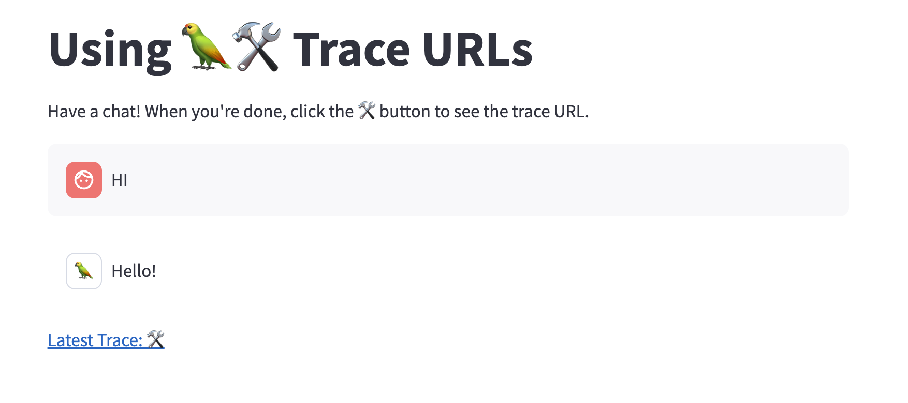

# Display Trace Links

When developing, adding a trace link in your UI can help you save time debugging.

In this walkthrough, you will share a link to your LangSmith trace using the following pattern:

```python
from langchain.callbacks import tracing_v2_enabled
from langsmith import Client

client = Client()

with tracing_v2_enabled() as cb:
    chain.invoke({"input": "<user-input>"})
    url = cb.get_run_url()
```

The `tracing_v2_enabled` callback collects the latest trace in-memory and returns a (private) link to the trace details for easy debugging.

The demo app will look like this:


## Setup

First, creating a python virtual environment, activate it, and install the project requirements requirements.

```
python -m virtualenv .venv
source .venv/bin/activate
python -m pip install -r requirements.txt 
```

Next, set your API keys. The demo uses Anthropic (and LangSmith):

```bash
export LANGCHAIN_API_KEY=...
export ANTHROPIC_API_KEY=...
```

After setup is done, run the application!

```python
ENVIRONMENT=dev python -m streamlit run app.py
```

This will spin up the local streamlit application. Try saying hello and clicking the trace URL!



## Conclusion

This completes the tutorial! Displaying URLs inline is an easy way to avoid having to search through your project to replay or analyze a run. 
